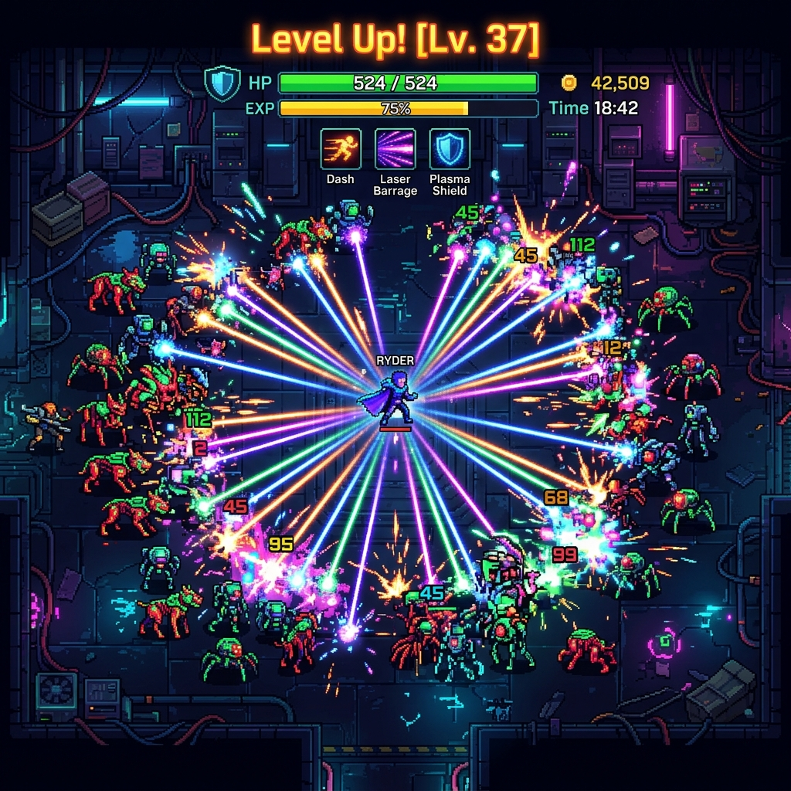
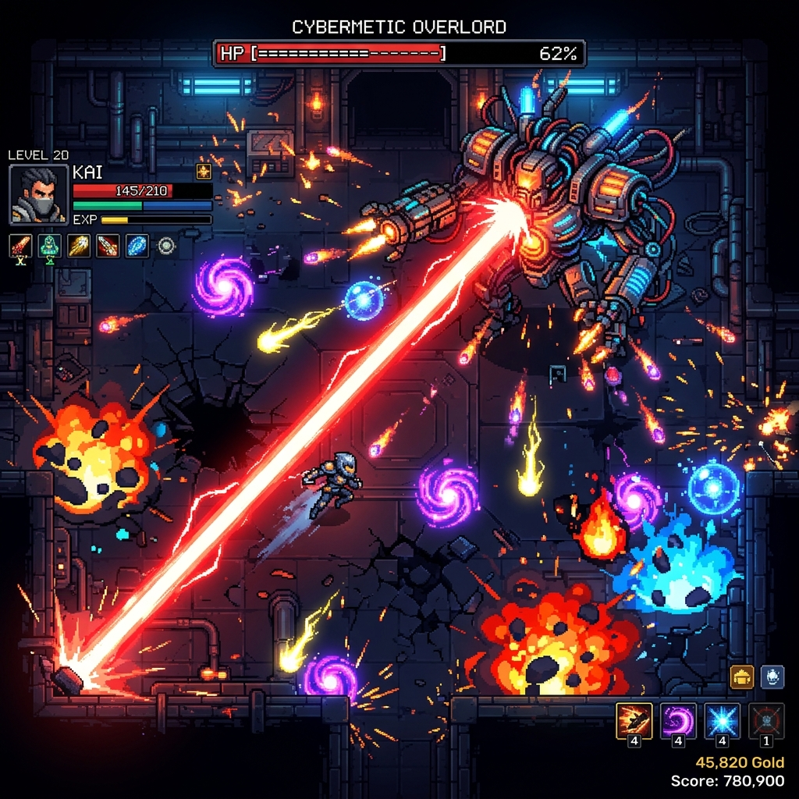

# Cyber Survivor: Transformer Roguelike 🚀

Welcome to **Cyber Survivor**, a fast-paced, top-down roguelite where you battle against endless hordes of neon-infused enemies! Harness powerful upgrades, trigger satisfying chain reactions, and survive as long as possible in this Vampire Survivors-inspired cybernetic arena.

## 📸 Glimpse of the Action

### The Hero

### Intense Gameplay

## 🌟 Key Features

*   **Dynamic Upgrades:** Over a dozen weapons and passives. Combine them to create screen-clearing evolutions!
*   **Frenzy Mode:** Build up your combo meter to unleash a devastating Frenzy state.
*   **Boss Encounters:** Face massive elite enemies and bullet-hell style boss encounters.
*   **Fluid Animations & Visuals:** Satisfying hit-stop effects, screen shakes, damage numbers, and neon glow.
*   **Responsive Controls:** Mouse & Keyboard or WASD to navigate the chaos.

## 🛠️ How to Play

1.  Clone this repository.
2.  Start a local server in the project directory (e.g., `npx http-server` or VSCode Live Server).
3.  Open `index.html` in your browser.
4.  Survive!

## ⚙️ Development

Built from scratch using vanilla HTML5 Canvas and JavaScript. No external engines, just pure math and code!
